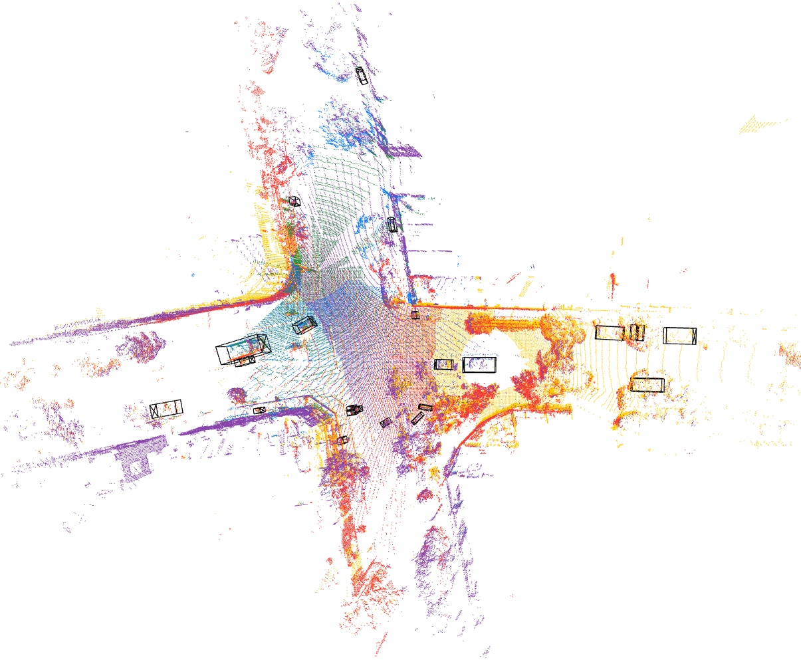

# DEVKIT OF MIXED SIGNALS DATASET
---

# 1. INSTALLATION

## 1.1 Dataset Inferface

The dataset interface **does not** require NVIDIA drivers and PyTorch.

```bash
conda create -n msig python=3.9
conda activate msig
pip install -r requirements.txt
python setup.py develop
```

---
# 2. VISUALIZING DATASET

Visualize point clouds in 1 data sample

```bash
cd mixedsignals

python mixedsignals/tools/visualize_agg_pointclouds.py
```

expected result:



Visualize tracks in 1 sequence


```bash
cd mixedsignals

python mixedsignals/tools/visualize_tracks.py
```